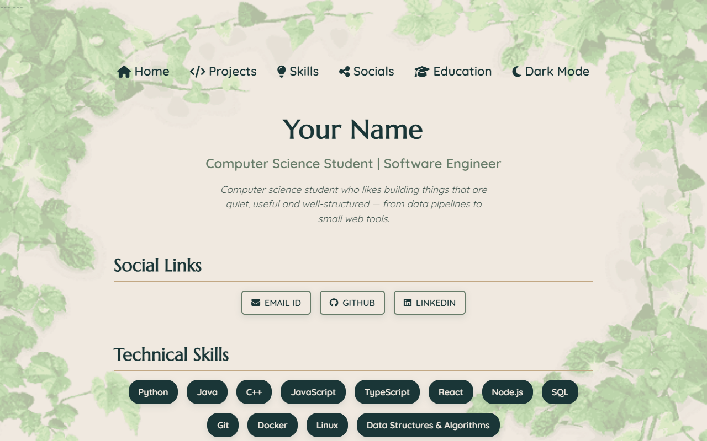
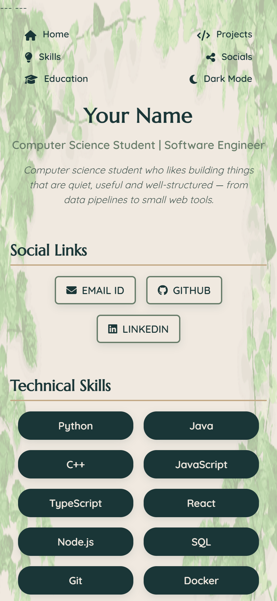

# 🌱 Nature Canvas – Earthy Portfolio Theme

The theme powering this portfolio: soft earth tones, a leaf-frame backdrop and a serif/sans pairing that stays quiet enough for technical content. Originally the Nature Canvas template from [Portfolio-Templates](https://github.com/madhurimarawat/Portfolio-Templates) by Madhurima Rawat, recoloured around a four-tone palette.

## 🎨 Colour palette

Defined in [`css/variables.css`](css/variables.css):

* `--sand` `#C2A884` — warm dry grass; heading underlines, card top borders, dark-mode headings
* `--sage` `#677C69` — soft moss; borders, hover states, metadata text
* `--forest` `#40534D` — damp bark; body copy in light mode, card surfaces at night
* `--pine` `#1A3637` — deep evergreen; headings and skill chips in light mode, the background in dark mode

Two tints of `--sand` (`--sand-mist`, `--sand-veil`) provide the light-mode page and card backgrounds, and `--sand-glow` carries body copy in dark mode, so text keeps a comfortable contrast ratio in both themes.

## 🗂️ Files

| File                    | Purpose                                                   |
| ----------------------- | --------------------------------------------------------- |
| `css/variables.css`     | Palette and typography tokens — start here to retint       |
| `css/main-styles.css`   | Layout, spacing and component structure                   |
| `css/index.css`         | Light mode colour application                             |
| `css/index-dark.css`    | Dark mode token remap                                     |
| `css/responsive-styles.css` | Breakpoint adjustments down to small phones           |
| `images/`               | Leaf frame background art                                 |
| `index.html`            | Theme page, served at `/Nature_Canvas`                     |

## 📱 Responsive & dual-mode

Fully responsive, with a dark mode toggle that persists through `localStorage` and honours the visitor's system preference on first load.

## 📸 Snapshots

🔙 [Back to the portfolio README](../README.md)

🖼️ **Background image credit:** [Green Leaves Frame – Transparent PNG](https://www.nicepng.com/png/full/78-788269_green-leaves-frame-transparent-background-border-leaves.png). Thanks to the original artist for this nature frame.
